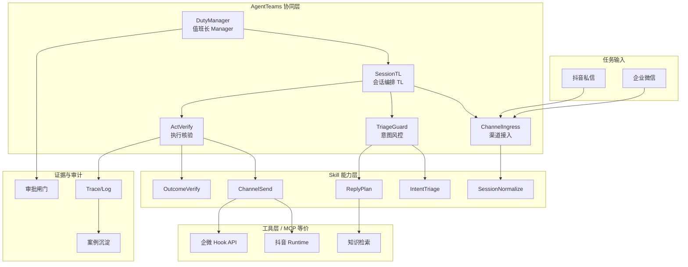

# AgentDesk 初赛方案 PPT 大纲（12 页）

> 导出为 `02_方案PPT.pdf` 后放入提交 zip。

| 页码 | 标题 | 内容要点 |
|---|---|---|
| P1 封面 | 私域客服自治工作台（AgentDesk） | 赛道：新智基座｜方向：智能客服自主闭环｜团队名 |
| P2 背景与痛点 | 为什么需要 Agent Infra | 多渠道分散、回复不可验证、高风险无审批、经验难沉淀；单 Bot 不够 |
| P3 场景与价值 | 目标用户与收益 | 私域运营/客服团队；提效、降错、可审计、可复制 |
| P4 总体架构 | AgentTeams 分层架构图 | Manager–TL–Worker；5 Agent；Skill/MCP/渠道 Runtime 分层 |
| P5 Agent 分工 | Agent Identity 一览 | 5 个 Agent 职责、边界、禁止事项（表格） |
| P6 任务拆解与状态机 | 从入站到闭环 | Task 拆解步骤；SessionTL 状态流转图 |
| P7 Skill 工程体系 | 5 个核心 Skill | 名称、输入输出、复用价值、失败处理（表格） |
| P8 工具集成 | MCP 等价契约 | send/query/history 工具 Schema；迁移成本说明 |
| P9 闭环与演示 | 两条剧本 | 主路径 + 高风险审批路径；抖音深做、企微扩展 |
| P10 验证与审计 | 生产级保障 | OutcomeVerify、profile 隔离、审批回滚、证据沉淀 |
| P11 可观测与上下文 | Trace/Log + 共享状态 | 4 选 2 能力说明；后续 AgentLoop 对接计划 |
| P12 落地计划与开源 | 初赛→复赛→决赛 | 8.16 方案；复赛 AgentTeams 代码包；开源 Skill/Identity 模板 |

## 架构图参考（P4/P6 可复用）

## PPT 制作提示

- 每页 1 张图 + 3–5 条要点，少堆字
- P5/P7 可直接引用 `03_Agent_Identity清单.md`、`04_Skill清单.md` 表格
- P9 用两条剧本讲清「不是会聊天，是会协作、会卡点、会留证」
